This is the corrective engineering specification. It addresses the "Wiring Mismatch" in the Generation Probe and the "Hallucination" in the Normalization prompt.

# Engineering Spec: Generation Probe Repair & Normalization Tuning

## 1. Executive Summary

**Current Status:** The evaluation harness is functional but yielding false negatives.
**Problem:**

1. **Phase C (Generation Probe) Wiring Failure:** The probe sends data to `ContentGeneratorService` using incorrect array keys (`overrides` vs `vipOverrides`) and incorrect payloads (Chunk Arrays vs IDs). Consequently, the generator ignores the context, resulting in "No information available" responses.
2. **Phase A (Normalization) Fidelity Failure:** The LLM normalization prompt is stripping attribution verbs (e.g., changing "Acme *announced* they acquired" to "Acme acquired"), causing the Faithfulness Audit to flag violations.

**Objective:**

1. **Fix Wiring:** Align `GenerationProbe` arguments strictly with `ContentGeneratorService::generate` signature.
2. **Add Observability:** Implement "Context Echo" to verify the generator actually received and used the chunks.
3. **Tune Prompts:** Adjust Normalization instructions to preserve certainty markers.

---

## 2. Technical Implementation: Phase C (Wiring Fix)

The primary failure is that the Probe is "shouting into the void"—sending context in a format the Service does not recognize.

### 2.1 The Wiring Diagram

```mermaid
graph TD
    subgraph "Current (Broken)"
    Probe[Generation Probe] -- "overrides: {knowledge: [Chunks]}" --> Service[ContentGeneratorService]
    Service -- "Unknown key 'overrides'" --> Ignore[Ignore Input]
    Ignore --> Result["Result: 'I don't know'"]
    end

    subgraph "Target (Fixed)"
    Probe2[Generation Probe] -- "vipOverrides: {knowledge: [ID]}" --> Service2[ContentGeneratorService]
    Service2 -- "Resolve ID to Chunks" --> Resolve[OverrideResolver]
    Resolve -- "Inject Context" --> Assembler[ContextAssembler]
    Assembler --> Result2["Result: Correct Answer"]
    end

```



### 2.2 Code Changes: `GenerationProbe`

**Location:** `App\Services\Ai\Evaluation\Probes\GenerationProbe.php`

**Change:** Update the `generate` call to match the `GenerationRequest` DTO requirements found in `ContentGeneratorService`.

```php
// ... inside the run() method

// 1. Define strict policy: NO retrieval, ONLY VIP overrides.
$options = [
    // Disable standard retrieval to prove we are testing the specific item
    'retrievalPolicy' => [
        'useRetrieval' => false, 
        'retrievalLimit' => 0, 
        'useBusinessFacts' => false
    ],
    
    // THE FIX: Use 'vipOverrides' key, passing the UUID, not the chunk array.
    'vipOverrides' => [
        'knowledge' => [$knowledgeItem->id], 
    ],
    
    // Constraints to ensure it acts like a QA bot, not a LinkedIn influencer
    'constraints' => [
        'max_chars' => 500,
        'emoji' => 'disallow',
        'tone' => 'analytical' // Less "creative", more "factual"
    ],
    
    // Force specific classification to avoid "intent" drift
    'classificationOverrides' => [
        'intent' => 'educational',
        'funnel_stage' => 'bof' // Bottom of funnel = more factual
    ]
];

// 2. Call the service
$result = $this->generator->generate(
    $orgId,
    $userId,
    $question, // The prompt
    'linkedin', // Platform (required but largely ignored due to tone constraints)
    $options
);

```

### 2.3 Observability: Context Echo

We must verify that `OverrideResolver` actually did its job. We cannot inspect the internal `Context` object directly from the outside, but we can inspect the returned metadata and `context_used`.

**Change:** Add logic to the Probe to inspect the result.

```php
// ... inside run() after generate()

// 3. Context Echo / Verification
$contextUsed = $result['context_used'] ?? [];
$snapshotId = $result['metadata']['run_id'] ?? null;

// Heuristic: If we sent a VIP override, 'context_used' should NOT be empty.
// (Note: ContentGeneratorService usually returns Snapshot IDs in context_used)
$contextWasInjected = !empty($contextUsed);

// log this to the report
$probeResult['diagnostics'] = [
    'context_injected_status' => $contextWasInjected ? 'success' : 'failed',
    'snapshot_id' => $snapshotId,
    'input_knowledge_id' => $knowledgeItem->id,
];

```

---

## 3. Technical Implementation: Phase A (Normalization Tuning)

The Faithfulness Audit is correctly identifying that our normalization is "hallucinating certainty." We need to fix the upstream prompt.

**Location:** `config/ai.php` (or wherever the `normalize_knowledge` prompt is stored).

**Change:** Update the system prompt instructions.

**Draft Prompt Update:**

> **Current Instruction (Implied):** "Extract claims and facts."
> **New Instruction:**
> "Extract atomic claims. You must preserve the level of certainty and attribution found in the source text.
> * If the text says 'Company X **announced** they will acquire Y', do NOT write 'Company X acquired Y'. Write 'Company X announced acquisition of Y'.
> * If the text says 'expected to close', do NOT write 'will close'.
> * Do not convert future tense events to past tense."
> 
> 

---

## 4. Success Criteria

1. **Probe Accuracy:** The `GenerationProbe` passes at least 2/3 questions for the `factual_short` fixture (up from 0/3).
2. **Context Verification:** The evaluation report `diagnostics` section shows `context_injected_status: success`.
3. **Faithfulness Score:** The Faithfulness Audit score improves (fewer "certainty mismatch" violations).

---

## 5. Immediate Next Step

**Action:** Rewrite `App\Services\Ai\Evaluation\Probes\GenerationProbe.php`.

This is the highest leverage fix. It converts the probe from a "broken simulation" to a "production-faithful integration test."